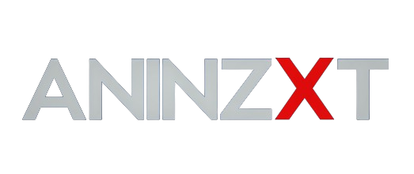

   

   
   
   
   

# **AniNZXT** ✳️

AniNZXT is an [Anilist](https://anilist.co/) only client, based on Dantotsu and Saikou (forked from Dantotsu)

> **AniNZXT** is aimed to entice the next generation of anime fans (and the veterans too!) to enjoy anime and manga at its fullest! AniNZXT initially started out as a website before becoming an app. Check it out for yerself!

### 🚀 STAR THIS REPOSITORY TO SUPPORT THE DEVELOPER AND ENCOURAGE THE DEVELOPMENT OF THE APPLICATION!

## WANT TO CONTRIBUTE? 🤝

All contributions are welcome, from code to documentation to graphics to design suggestions to bug reports. Please use GitHub to its fullest; contribute Pull Requests, contribute tutorials or other content - whatever you have to offer, we can use!

You can come hang out with our awesome community, request new features, and report any bugs or issues at our Discord server too. 📣

### OFFICIAL DISCORD SERVER 🚀

   

## VISITORS

## LICENSE 📜

Dantotsu is licensed under the Unabandon Public License (UPL). More info can be found [here.](LICENSE.md)
